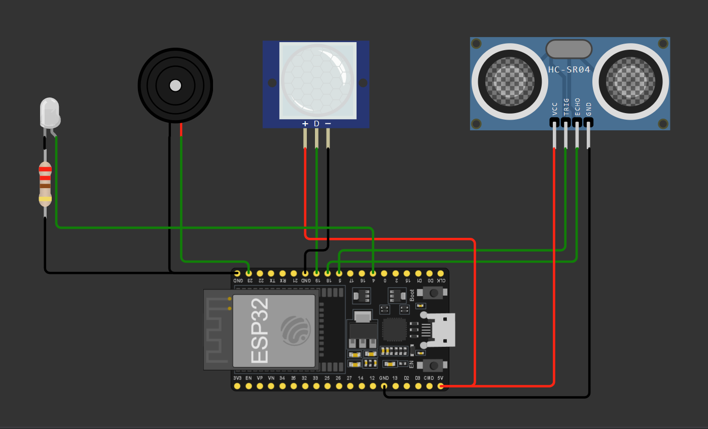

# Sistem Monitoring dan Kontrol Smart Room Berbasis IoT Menggunakan Protokol MQTT dengan Integrasi Telegram dan Aplikasi Mobile
Proyek ini merupakan simulasi dari konsep ruangan pintar yang dapat memudahkan pengguna untuk menghemat energi. Konsep ini dapat diterapkan pada gudang penyimpanan yang memudahkan petugas untuk mengontrol lampu tanpa perlu menyentuh saklarnya.

Proyek Sederhana ini disusun oleh kelompok 6 yang terdiri dari;
- Ammar Nabil Fauzan (2309106006)
- Zhorif Fachdiat (2309106014)
- Adhitya Fajar Al-Huda (2309106027)
- Muhammad Ghazali (2309106041)
---
### Pembagian Tugas

Agar proyek sederhana ini berjalan lancar, kami melakukan pembagian tugas berdasarkan keahlian masing-masing anggota
- Ammar bertugas untuk memastikan proyek sesuai dengan konsep dan menyusun laporan proyek akhir
- Zhorif membuat UI/UX kodular mobile dan merangkai alat agar berfungsi dengan semestinya dan
- Fajar membuat koneksi dengan blok kode agar client saling terhubung
- Ghazali mengoding agar alur PubSub agar clients bisa saling terhubung melalui broker, sehingga sesuai dengan skenario proyek.
---
### Komponen

Komponen yang digunakan pada proyek ini diantaranya;
1. 1 Esp32-WROOM-32D
2. 1 Sensor PIR
3. 1 Sensor Ultrasonic
4. 1 Buzzer
5. 1 Led
6. 1 Kabel USB to C
7. 11 Kabel jumper
---
### Board Schematics

  

